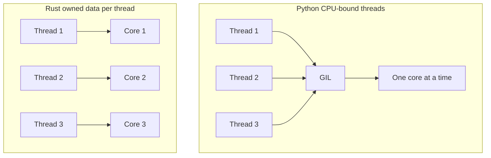

# Concurrency: Python's GIL Ceiling vs Rust

> **TL;DR** — Python threads serialize on the GIL; Rust threads run truly parallel because ownership + Send/Sync rule out data races at compile time.

Why Python can't scale CPU-bound work across cores, and why Rust can — by design.



## The problem: the GIL (Global Interpreter Lock)

CPython (the standard Python) has a **Global Interpreter Lock** — a single mutex that allows **only one thread to execute Python bytecode at a time**. No matter how many cores you have, only one thread runs Python code at any instant.

```python
# This DOESN'T make Python faster on 8 cores:
import threading

def work():
    # CPU-bound loop
    for _ in range(10_000_000):
        x = 1 + 1   # GIL: only one thread runs this at a time

threads = [threading.Thread(target=work) for _ in range(8)]
# ...8 threads, but they serialize on the GIL — no speedup
```

The GIL exists because CPython's memory management uses **reference counting**, which isn't thread-safe without protection. The lock is a pragmatic trade-off: simple and fast for single-threaded code, but it **caps multi-core parallelism** for CPU-bound work.

## The three "escape hatches" — and their limits

| Approach | What it does | Ceiling it hits |
|----------|--------------|-----------------|
| **`threading`** | OS threads, but GIL serializes bytecode | No CPU parallelism — 1 core effectively |
| **`multiprocessing`** | Separate processes, each with its own GIL | Works, but **memory isn't shared** — you pay IPC/serialization cost |
| **`asyncio`** | Cooperative single-threaded concurrency | Great for I/O-bound, **useless for CPU-bound** |

So Python's real ceiling is: **CPU-bound parallelism is expensive or impossible**. You either get fake threading (GIL) or pay heavy process+IPC overhead.

## Why Rust has no such ceiling

Rust's model is fundamentally different. It has **no GIL**, and it doesn't need one, because:

### 1. Ownership eliminates data races at compile time

Python needs the GIL to protect shared memory. Rust instead makes *sharing* hard to get wrong:

```rust
// Rust: spawn 8 threads, each owns its data — no lock needed
use std::thread;

let handles: Vec<_> = (0..8).map(|i| {
    thread::spawn(move || {
        let result = i * 2;   // `i` is MOVED into this thread — no sharing
        result
    })
}).collect();
```

Because values are **owned** by exactly one thread (moved in) and only shared via `&`/`&mut` with compile-time checked lifetimes, there's no *data race* to guard against. The borrow checker enforces it — you literally can't write code where two threads mutate the same data unsafely.

### 2. `Send` / `Sync` — the compiler tells you what's safe to share

Rust has marker traits:
- `Send`: a type can be moved across threads
- `Sync`: a type can be shared by reference across threads

These are **compile-time guarantees**. You can't share a non-`Send` type across threads. The error shows up at build time, not as a random runtime deadlock or crash.

### 3. True parallelism with `std::thread` — no lock to serialize

When you spawn threads in Rust, they genuinely run in parallel on all cores. No global lock throttles CPU-bound work:

```rust
let handles: Vec<_> = (0..8).map(|_| {
    thread::spawn(|| expensive_cpu_bound())  // runs in PARALLEL
}).collect();
```

## The honest nuance: Rust still needs synchronization

Rust isn't "concurrency without locks" — it's "concurrency where the compiler *forces you to* use locks correctly when sharing." When threads genuinely share data:

```rust
let counter = Arc::new(Mutex::new(0));  // Arc = shared ownership, Mutex = the lock
```

You still use `Mutex`/`RwLock` for *shared mutable* state. But the difference is:
- **Python**: the GIL is *always there*, even when you don't need it, serializing everything.
- **Rust**: synchronization is *opt-in per data structure*, and only where you actually share. Independent data runs truly parallel with zero contention.

## Summary table

| Aspect | Python | Rust |
|--------|--------|------|
| Global lock? | **Yes (GIL)** — serializes all bytecode | **No** |
| Threads parallel? | No (GIL) | Yes — across all cores |
| CPU-bound parallelism | Only via `multiprocessing` (expensive) | Native, free |
| Data-race safety | Runtime (GIL masks it) | **Compile-time** (ownership + `Send`/`Sync`) |
| Sharing mutable state | GIL protects it (slowly) | Explicit `Mutex`/`Arc` — compiler checks it |
| Why no lock needed | — | Ownership means data isn't shared unless you choose |

## Key takeaways

1. Python's GIL serializes all threads — CPU-bound parallelism means paying for `multiprocessing` + IPC.
2. Rust has no global lock: ownership keeps thread data separate, `Send`/`Sync` gate sharing at compile time.
3. Shared mutable state still needs `Mutex`/`Arc` — the difference is it is opt-in per value, not paid on every operation.
