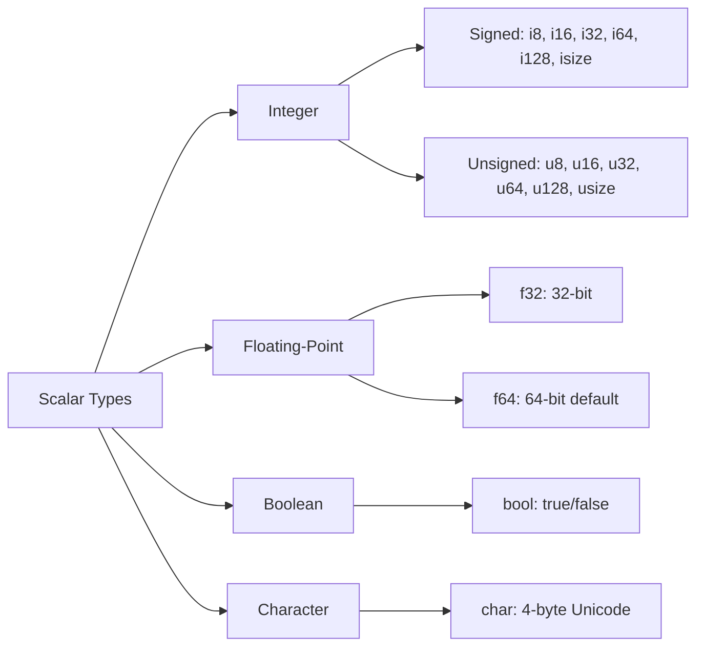
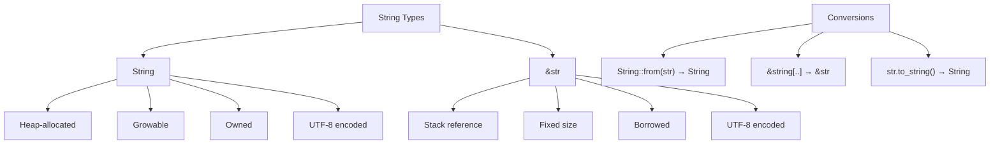
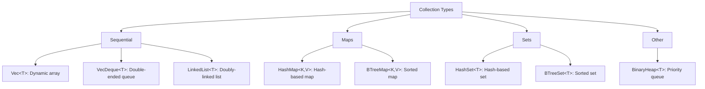
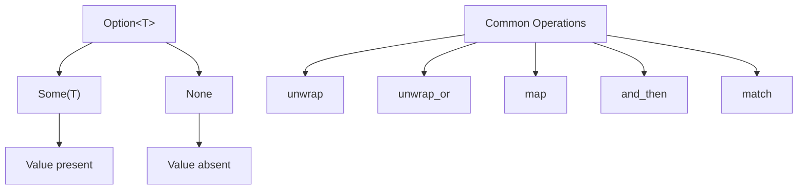
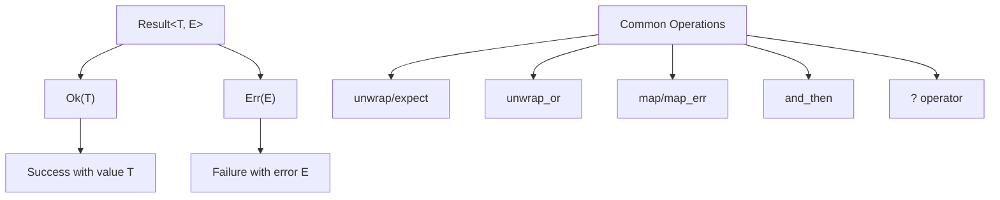
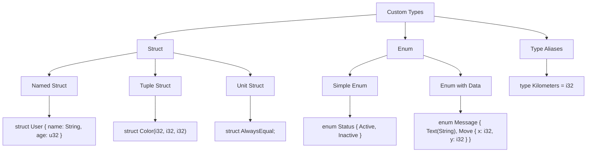
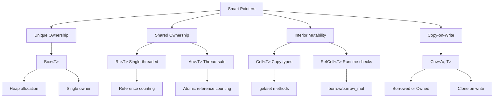

# Rust Data Types

Rust is a statically typed language, meaning every value must have a known type at compile time. This document outlines all the primary data types available in Rust.

## Type Hierarchy Overview

```mermaid
graph TD
    A[Rust Types] --> B[Primitive Types]
    A --> C[User-Defined & Standard Library Types]

    B --> D[Scalar Types]
    B --> E[Compound Types]
    B --> F[Reference Types]
    B --> G[Function Types]
    B --> H[Special Types]

    D --> D1[Integer: i8-i128, u8-u128]
    D --> D2[Float: f32, f64]
    D --> D3[Boolean: bool]
    D --> D4[Character: char]

    E --> E1[Tuple]
    E --> E2[Array]

    F --> F1[&T Shared Reference]
    F --> F2[&mut T Mutable Reference]
    F --> F3[*const T, *mut T Raw Pointers]

    G --> G1[fn Function Pointers]
    G --> G2[Closures]

    H --> H1[! Never Type]
    H --> H2["() Unit Type"]

    C --> I[Custom Types]
    C --> J[String Types]
    C --> K[Collections]
    C --> L[Smart Pointers]
    C --> M[Error Handling]

    I --> I1[Struct]
    I --> I2[Enum]
    I --> I3[Type Aliases]

    J --> J1[String owned]
    J --> J2[&str borrowed]

    K --> K1["Vec&lt;T&gt;"]
    K --> K2["HashMap&lt;K,V&gt;"]
    K --> K3["HashSet&lt;T&gt;"]

    L --> L1["Box&lt;T&gt;"]
    L --> L2["Rc&lt;T&gt;"]
    L --> L3["Arc&lt;T&gt;"]
    L --> L4["RefCell&lt;T&gt;"]

    M --> M1["Option&lt;T&gt;"]
    M --> M2["Result&lt;T,E&gt;"]
```



## Scalar Types

Scalar types represent a single value.



### Integer Types

Signed integers (can be positive or negative):
- `i8`: 8-bit signed integer (-128 to 127)
- `i16`: 16-bit signed integer (-32,768 to 32,767)
- `i32`: 32-bit signed integer (-2,147,483,648 to 2,147,483,647) - **default**
- `i64`: 64-bit signed integer
- `i128`: 128-bit signed integer
- `isize`: pointer-sized signed integer (depends on architecture: 32-bit or 64-bit)

Unsigned integers (positive only):
- `u8`: 8-bit unsigned integer (0 to 255)
- `u16`: 16-bit unsigned integer (0 to 65,535)
- `u32`: 32-bit unsigned integer (0 to 4,294,967,295)
- `u64`: 64-bit unsigned integer
- `u128`: 128-bit unsigned integer
- `usize`: pointer-sized unsigned integer (depends on architecture)

Integer literals can be written in different forms:
```rust
let decimal = 98_222;      // Decimal
let hex = 0xff;            // Hexadecimal
let octal = 0o77;          // Octal
let binary = 0b1111_0000;  // Binary
let byte = b'A';           // Byte (u8 only)
```

### Floating-Point Types

- `f32`: 32-bit floating point (single precision)
- `f64`: 64-bit floating point (double precision) - **default**

```rust
let x = 2.0;      // f64 (default)
let y: f32 = 3.0; // f32
```

### Boolean Type

- `bool`: true or false

```rust
let t = true;
let f: bool = false;
```

### Character Type

- `char`: 4-byte Unicode scalar value (represents a single Unicode character)

```rust
let c = 'z';
let z: char = 'ℤ';
let emoji = '😻';
```

## Compound Types

Compound types can group multiple values into one type.

### Tuple Type

Fixed-length collection of values of different types.

```rust
let tup: (i32, f64, u8) = (500, 6.4, 1);
let (x, y, z) = tup;  // Destructuring
let five_hundred = tup.0;  // Access by index
```

### Array Type

Fixed-length collection of values of the same type, allocated on the stack.

```rust
let a: [i32; 5] = [1, 2, 3, 4, 5];
let months = ["January", "February", "March"];
let a = [3; 5];  // Same as [3, 3, 3, 3, 3]
let first = a[0];  // Access by index
```

## String Types



### `String`
- Heap-allocated, growable UTF-8 encoded string
- Owned type

```rust
let mut s = String::from("hello");
s.push_str(", world!");
```

### `&str` (String Slice)
- String slice, usually borrowed
- Fixed size, immutable reference to string data

```rust
let s = "hello, world";  // &str
let slice = &s[0..5];    // &str
```

## Collection Types



### Vector (`Vec<T>`)
- Growable array allocated on the heap
- All elements must be the same type

```rust
let v: Vec<i32> = Vec::new();
let v = vec![1, 2, 3];
```

### HashMap (`HashMap<K, V>`)
- Key-value pairs
- Keys must be the same type, values must be the same type

```rust
use std::collections::HashMap;

let mut scores = HashMap::new();
scores.insert(String::from("Blue"), 10);
```

### HashSet (`HashSet<T>`)
- Collection of unique values

```rust
use std::collections::HashSet;

let mut set = HashSet::new();
set.insert(1);
```

### Other Collections
- `VecDeque<T>`: Double-ended queue
- `LinkedList<T>`: Doubly-linked list
- `BTreeMap<K, V>`: Sorted map
- `BTreeSet<T>`: Sorted set
- `BinaryHeap<T>`: Priority queue

## Reference Types

### References
- `&T`: Immutable reference (borrowing)
- `&mut T`: Mutable reference (exclusive borrowing)

```rust
let x = 5;
let y = &x;        // Immutable reference
let mut z = 10;
let w = &mut z;    // Mutable reference
```

### Raw Pointers
- `*const T`: Raw immutable pointer
- `*mut T`: Raw mutable pointer
- Unsafe to dereference

## Function Types

Functions have their own types:

```rust
fn add_one(x: i32) -> i32 {
    x + 1
}

let f: fn(i32) -> i32 = add_one;
```

## Closure Types

Closures are anonymous functions that can capture their environment:

```rust
let add = |x, y| x + y;
```

## Never Type

- `!`: The "never" type for functions that never return

```rust
fn infinite_loop() -> ! {
    loop {}
}
```

## Unit Type

- `()`: Empty tuple, represents absence of a value

```rust
fn do_something() -> () {
    println!("doing something");
}
// Equivalent to:
fn do_something() {
    println!("doing something");
}
```

## Option Type



Represents an optional value:

```rust
enum Option<T> {
    Some(T),
    None,
}

let some_number = Some(5);
let absent_number: Option<i32> = None;
```

## Result Type



Used for error handling:

```rust
enum Result<T, E> {
    Ok(T),
    Err(E),
}
```

## Custom Types



### Struct
Named product type (fields with names):

```rust
struct User {
    username: String,
    email: String,
    active: bool,
}

// Tuple struct
struct Color(i32, i32, i32);

// Unit struct
struct AlwaysEqual;
```

### Enum
Sum type (one of several variants):

```rust
enum IpAddr {
    V4(u8, u8, u8, u8),
    V6(String),
}

enum Message {
    Quit,
    Move { x: i32, y: i32 },
    Write(String),
    ChangeColor(i32, i32, i32),
}
```

## Type Aliases

Create a new name for an existing type:

```rust
type Kilometers = i32;
type Result<T> = std::result::Result<T, std::io::Error>;
```

## Smart Pointer Types



- `Box<T>`: Heap-allocated value
- `Rc<T>`: Reference counted pointer
- `Arc<T>`: Atomically reference counted pointer
- `Cell<T>`: Interior mutability for `Copy` types
- `RefCell<T>`: Interior mutability with runtime borrow checking
- `Cow<'a, T>`: Clone-on-write smart pointer

## Summary

Rust's type system is designed to be both safe and expressive. The compiler uses these types to:
- Prevent memory safety issues
- Ensure thread safety
- Catch errors at compile time
- Enable zero-cost abstractions

Understanding these types is fundamental to writing effective Rust code.
