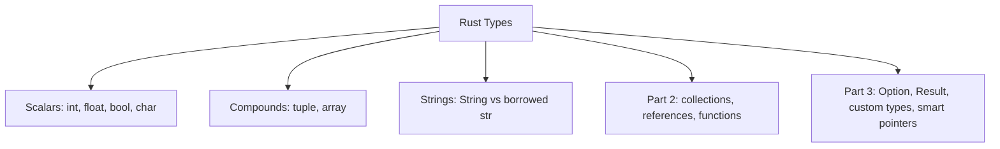

# Data Types: Scalars, Compounds & Strings

> **TL;DR** — Start here for the type system. Scalars (`i32`, `f64`, `bool`, `char`) and compounds (tuple, array) are value types with fixed sizes — unlike Python's arbitrary-precision `int` and dynamic `list`. `String` vs `&str` (owned vs borrowed) is the first ownership idea you'll meet.

This is part 1 of 3. Part 2 covers [collections, references & functions](./rust-collections.md); part 3 covers [`Option`, `Result`, custom types & smart pointers](./rust-custom-types.md).

## Where This Page Fits


```mermaid
graph TD
    A[Rust Types] --> B[Scalars: int, float, bool, char]
    A --> C[Compounds: tuple, array]
    A --> D[Strings: String vs borrowed str]
    A --> E["Part 2: collections, references, functions"]
    A --> F["Part 3: Option, Result, custom types, smart pointers"]
```

## Scalars

One value, fixed size. The headline difference from Python: every integer and float has an explicit width — there is no arbitrary-precision `int`.

| Rust | Python equivalent | Notes |
|------|-------------------|-------|
| `i8`–`i128`, `u8`–`u128`, `isize`/`usize` | `int` | Fixed width; overflow is a compile/runtime concern, not silently handled |
| `f32`, `f64` (default) | `float` (C double ≈ `f64`) | Same IEEE-754 semantics |
| `bool` | `bool` | `true`/`false` — lowercase in both |
| `char` | 1-character `str` | 4-byte Unicode scalar; Rust has no separate "string char" |

### Integers

Signed (`i8`–`i128`, `isize`) hold negatives; unsigned (`u8`–`u128`, `usize`) hold zero and up. `i32` is the default; `isize`/`usize` match the pointer width and are used for indexing.

```rust
let decimal = 98_222;      // i32 (default)
let hex = 0xff;            // Hexadecimal
let octal = 0o77;          // Octal
let binary = 0b1111_0000;  // Binary
let byte = b'A';           // Byte (u8 only)
let idx: usize = 3;        // indexing type
```

```python
decimal = 98222
hex_val = 0xFF
byte = ord("A")
```

> [!WARNING]
> Python `int` never overflows; Rust integers wrap in release mode and panic in debug mode on overflow. Use `wrapping_*` / `checked_*` / `saturating_*` methods when overflow is possible.

### Picking a size

The number in the type name is **bits of storage**, not how important the value is. Python `int` grows as needed; a Rust `i32` is always 4 bytes.

Start with the default unless the domain forces a different width.

| Situation | Pick | Why |
|-----------|------|-----|
| Everyday integers (counters, most locals) | **`i32`** | compiler default; plenty of range |
| Indexes, `len()`, array/`Vec` subscripts | **`usize`** | unsigned, pointer-sized; APIs require it |
| Bytes, ASCII, 0–255, buffers | **`u8`** | one byte |
| File sizes, IDs, timestamps, “could be huge” | **`u64` / `i64`** | `i32` tops out around 2 billion |
| Need negatives | **`i…`** | `u…` cannot go below 0 |
| Never negative and you mean it | **`u…`** | documents the invariant |
| Everyday floats | **`f64`** | same as Python `float` |
| Lots of floats (graphics, ML, audio) | **`f32`** | half the memory, less precision |
| Bigger than `i64` on purpose | **`i128`** or a crate | rare; unlimited Python `int` is not built in |

If you are unsure: **`i32`** and **`f64`**. Switch when the compiler or the data range tells you to — `usize` for indexes is the common forced switch.

### Floats, Bools, Chars

```rust
let x = 2.0;      // f64 (default)
let y: f32 = 3.0; // f32

let t = true;
let f: bool = false;

let c = 'z';
let z: char = 'ℤ';   // 4-byte Unicode scalar
let emoji = '😻';
```

```python
x = 2.0
t = True
c = "z"   # Python has no char type — single-character str
```

## Compounds

Fixed-length groups. Both live on the stack and their size is part of the type.

| Rust | Python equivalent | Notes |
|------|-------------------|-------|
| Tuple `(i32, f64, u8)` | `tuple` | Mixed types OK; destructuring works in both |
| Array `[i32; 5]` | `list` (fixed-length use) / `tuple` | Single element type, fixed length — unlike Python lists |

```rust
let tup: (i32, f64, u8) = (500, 6.4, 1);
let (x, y, z) = tup;      // destructuring
let five_hundred = tup.0; // access by index

let a: [i32; 5] = [1, 2, 3, 4, 5];
let b = [3; 5];           // [3, 3, 3, 3, 3]
let first = a[0];
```

```python
tup = (500, 6.4, 1)
x, y, z = tup
a = [1, 2, 3, 4, 5]
```

Need growable or mixed-type collections? That's [`Vec` and friends](./rust-collections.md#collections).

## Strings: `String` vs `&str`

The single most confusing split for newcomers — one type owns its data, the other borrows it:

| | `String` | `&str` |
|---|---|---|
| Ownership | Owned, heap-allocated, growable | Borrowed view into string data |
| Size | Dynamic | Fixed (a reference) |
| Python parallel | `str` you can mutate via concatenation | A read-only view — closest is `str` itself (immutable) |
| Literal type | `String::from("hi")` | `"hi"` is `&str` by default |

```rust
let mut s = String::from("hello");
s.push_str(", world!");   // growable — like += on a Python str

let s = "hello, world";   // &str (borrowed)
let slice = &s[0..5];     // &str slice — like s[0:5]
```

Conversions you'll use constantly:

| From → To | How |
|-----------|-----|
| `&str` → `String` | `String::from(s)` or `s.to_string()` |
| `String` → `&str` | `&s` or `&s[..]` (deref coercion) |

### `&'static str`

`'static` is a **lifetime**: how long a borrow is allowed to last. `&'static str` means “a `&str` that is valid for the whole program.”

String literals are `'static` because the bytes live in the binary, not on the heap:

```rust
pub fn hello() -> &'static str {
    "Hello, World!"   // baked into the program; never freed
}
```

Python parallel: a string literal is an interned `str` that lasts as long as the process. Rust writes that down as `'static`. You rarely invent `'static` yourself — returning a literal is enough for the compiler to infer it.

Not every `&str` is `'static`. A slice of a `String` only lasts as long as that `String`:

```rust
fn first_word(s: &str) -> &str {  // tied to `s`, not 'static
    s.split_whitespace().next().unwrap()
}
```

| Type | Lives until |
|------|-------------|
| `&'static str` (`"hi"`) | process exit |
| `&str` from `&some_string` | the `String` is dropped |
| `String` | its owner is dropped |

A struct that stores `&str` needs *some* lifetime; storing `&'static str` is the special case that only works for literals (or leaked memory). Prefer an owned `String` if the text is built at runtime — see [Ownership](./rust-ownership.md#when-to-own-vs-borrow).

> [!NOTE]
> `&str` is your first encounter with borrowing: the literal's data is owned elsewhere and you're viewing it. `'static` is the name for “elsewhere = the binary, forever.” Part 2 generalizes this to [all reference types](./rust-collections.md#reference-types), and [Ownership](./rust-ownership.md) explains why the distinction exists.

## Key Takeaways

1. Widths are explicit (`i32` vs `u64`, `f32` vs `f64`) — Python hides this; Rust makes you choose. Default to `i32` / `f64`; use `usize` for indexes.
2. Tuples and arrays are fixed-size value types; growable storage is `Vec` (part 2).
3. `String` (owned) vs `&str` (borrowed) previews the ownership system — learn the split now and borrowing later is easier. `"hi"` is `&'static str`: a borrow that lasts the whole program.

## Next

- [Collections, References & Functions](./rust-collections.md) — `Vec`/`HashMap`, `&T`/`&mut T`, closures, `()` and `!`.
- [Option, Result, Custom Types & Smart Pointers](./rust-custom-types.md) — null-safety, error handling, `struct`/`enum`, `Box`/`Rc`/`Arc`.
