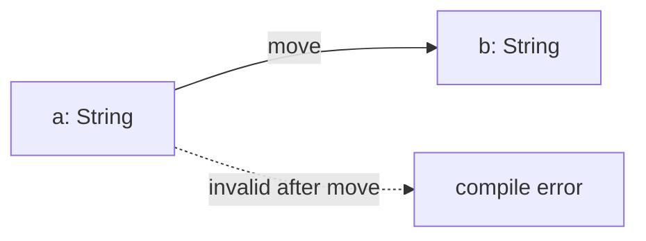
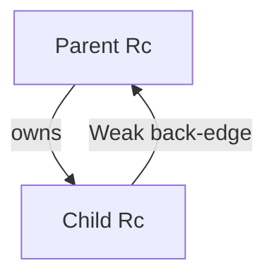

# Rust Ownership

> **TL;DR** — Every value has exactly one owner; when the owner drops, the value frees. Borrow to *use* a value, own to *keep* it; `&T` to read, `&mut T` to write; never both at once.

The core of Rust's memory safety — and the reason circular references are nearly impossible to construct by accident.



## The core rule

Every value in Rust has **exactly one owner** at any moment. When the owner goes out of scope, the value is dropped (memory freed) automatically.

```rust
let a = String::from("hello"); // `a` owns the String
let b = a;                     // ownership MOVES to `b`; `a` is now invalid
// println!("{a}");            // compile error — use after move
```

Python names are labels that point at objects. Rust names are storage that **owns** the value. After a move, the old name is gone — there is no second label on the same object.

## When to own vs borrow

Ask: *after this function/block returns, should the value still exist here?*

| If you need to… | Use | Why |
|-----------------|-----|-----|
| Keep it, store it, return it later | **own** (`T`) | you are the owner |
| Read or use it temporarily, then forget it | **borrow** (`&T` or `&mut T`) | the caller still owns it |
| Give it away | **move** (pass `T`) | ownership transfers |

Function signatures make the choice:

```rust
fn len(s: &str) -> usize { s.len() }          // borrow — just look
fn shout(s: &mut String) { s.push_str("!"); } // exclusive borrow — mutate in place
fn take(s: String) -> String { s }            // own — you keep / return it
```

```rust
let mut name = String::from("hi");

len(&name);        // look, still yours
shout(&mut name);  // mutate, still yours
let gone = take(name); // moved — `name` is invalid after this
```

**Borrowed when you needed to own** — a struct cannot store `&str` without a lifetime that outlives the struct. Store `String` instead.

**Owned when a borrow was enough** — `fn is_empty(s: String)` steals the string for a yes/no question. Take `&str`.

## Shared vs exclusive borrows

Once you borrow, pick the permission. See [reference types](./rust-collections.md#reference-types) for the type table.

| Borrow | Permission | How many at once |
|--------|------------|------------------|
| `&T` | read | many |
| `&mut T` | read **and** write | **exactly one**, and no `&T` at the same time |

- **`&T`** — default. Print, search, hash, parse, length.
- **`&mut T`** — only when you change the caller's value in place. Push, insert, sort.

The compiler's invariant: **either** many readers **or** one writer, never both. That's how Rust bans data races without a GIL — [Concurrency](./concurrency-gil.md) is the same rule on threads.

`&` is not a copy. It is a view: pointer + (for slices) length into data owned elsewhere. `"42"` is already `&str` — a borrow of a literal in the binary. `&s` on a `String` produces a `&str` into that heap buffer.

## Copy types skip the dilemma

`i32`, `bool`, `f64`, `char` implement `Copy`. Passing them duplicates the bits; the original stays valid. No borrow needed:

```rust
fn add(a: i32, b: i32) -> i32 { a + b }
```

`String`, `Vec`, and other heap types do **not** copy. Passing them moves unless you borrow (or call `.clone()`).

## `unwrap`: pulling a value out of `Result` / `Option`

Fallible work returns a wrapper, not the inner value. `parse` returns `Result<i32, ParseIntError>` because `"hello"` is not an integer.

`unwrap()` means: if `Ok(v)` / `Some(v)`, give me `v`; if `Err` / `None`, **panic**. Fine for prototypes and inputs you have already validated. In real code prefer `match`, `?`, `expect("why this must succeed")`, or `unwrap_or(default)`.

```rust
let n: i32 = "42".parse().unwrap();           // Result → i32, or crash
let n: i32 = "42".parse().expect("digits");   // same, with a message
let n: i32 = "x".parse().unwrap_or(0);        // fallback
```

Python parallel: `int("42")` raises `ValueError` on junk; `unwrap` is the crash-on-failure path. Full operation table: [`Option` / `Result`](./rust-custom-types.md).

## Shadowing

`let` on an existing name creates a **new** variable. The old binding is hidden, so the type can change — this is not mutation of the first value:

```rust
let input = "42";                              // &str
let input = input.parse::<i32>().unwrap();     // new `input`: i32
let input = input * 2;                         // new `input`: i32, value 84
```

`parse` borrows the `&str` (`&self`) and returns an owned `i32`. Each `let input` is a fresh owner.

## Why this kills circular references

In GC languages (Java, Python, JS), objects hold *pointers* to each other. If A points to B and B points back to A, neither is ever "unreachable" — the garbage collector can't collect the cycle. Classic memory leak.

Rust's ownership model makes this **impossible by default**:

1. **You can't have two owners.** A cycle needs A to own B *and* B to own A. But only one owner exists. If A owns B, then B owning A would require B to own the thing that owns it — a self-referential structure.

2. **Borrows can't create cycles.** You could try:
   ```rust
   struct Node {
       value: i32,
       parent: Option<&'a Node>, // borrow, not ownership
   }
   ```
   The borrow checker rejects this. A borrow (`&`) must live *inside* the owner's lifetime. You can't have B borrow A while A owns B — the borrow of A would outlive A. It's a lifetime error.

So the **compile-time guarantee** is: with plain ownership + borrowing, you physically cannot construct a cycle. The borrow checker won't let you write code that does.

## Ownership by composition — the safe default

The idiomatic way to build a tree (parent owns children) uses **owned inline** values:

```rust
struct Node {
    value: String,
    children: Vec<Node>,  // Children are OWNED — no cycles possible
}

impl Node {
    fn new(value: &str) -> Self {
        Node { value: value.to_string(), children: Vec::new() }
    }

    fn add_child(&mut self, child: Node) {
        self.children.push(child);  // Ownership transfers here
    }
}
```

Here each node is a direct value inside its parent, not a pointer. No node can own its ancestor, because there's no pointer to loop back. When the root drops, all children drop recursively — deterministic, zero overhead, no GC. This design *can't even express* a cycle.

## Where cycles *can* happen — `Rc`

To build a graph or parent/child tree where children know their parent, you need **shared ownership** — something both A and B can refer to. That's `Rc<T>` (reference counting):

```rust
use std::rc::Rc;
use std::cell::RefCell;

struct Node {
    value: i32,
    children: RefCell<Vec<Rc<Node>>>,
    parent: RefCell<Option<Rc<Node>>>, // Rc = shared ownership
}
```

Now A and B *can* point to each other. But `Rc` uses **runtime** reference counting — when the last `Rc` drops, memory frees. A cycle means the counts never reach zero:

```
A.parent -> B
B.children -> A
```

Neither count ever hits 0 → **memory leak**. This is the exact problem Rust's ownership normally prevents, now reintroduced through the back door.

## The fix: `Weak`



The Rust-idiomatic solution is `Weak<T>` — a **non-owning** reference. It does *not* keep the value alive. Combine it with `Rc`:

```rust
use std::rc::{Rc, Weak};

struct Node {
    value: i32,
    parent: RefCell<Option<Weak<Node>>>, // Weak breaks the cycle
    children: RefCell<Vec<Rc<Node>>>,
}
```

Now:
- Parent → child: `Rc` (strong, owns, keeps alive)
- Child → parent: `Weak` (weak, doesn't own, doesn't keep alive)

When the last strong `Rc` drops, the `Node` frees even if weak refs still exist. To use a `Weak`, you `upgrade()` it → returns `Option<Rc>` (None if the value already died).

## Summary table

| Mechanism | Can it make a cycle? | Cycle consequence | Solution |
|-----------|---------------------|-------------------|----------|
| Ownership + `&` borrow | **No** — borrow checker rejects it | Impossible | None needed |
| `Rc` + `RefCell` | Yes | Runtime memory leak (refcount never hits 0) | Use `Weak` for back-edges |
| `Arc` (thread-safe `Rc`) | Yes | Same leak | Use `Weak` |

## Key takeaways

1. Borrow to *use*, own to *keep*; `&` to *read*, `&mut` to *write*; never both at once.
2. One owner per value; borrows are temporary and lifetime-checked — cycles are unrepresentable by default.
3. Need shared ownership? Reach for `Rc` (single-threaded) or `Arc` (thread-safe) — then break back-edges with `Weak`.
4. `unwrap` pulls `Ok`/`Some` apart and panics otherwise; `upgrade()` on a `Weak` returns `Option` — the parent may already be gone.

## Next

- [Concurrency without a GIL](./concurrency-gil.md) — how ownership scales to threads via `Send`/`Sync`.
