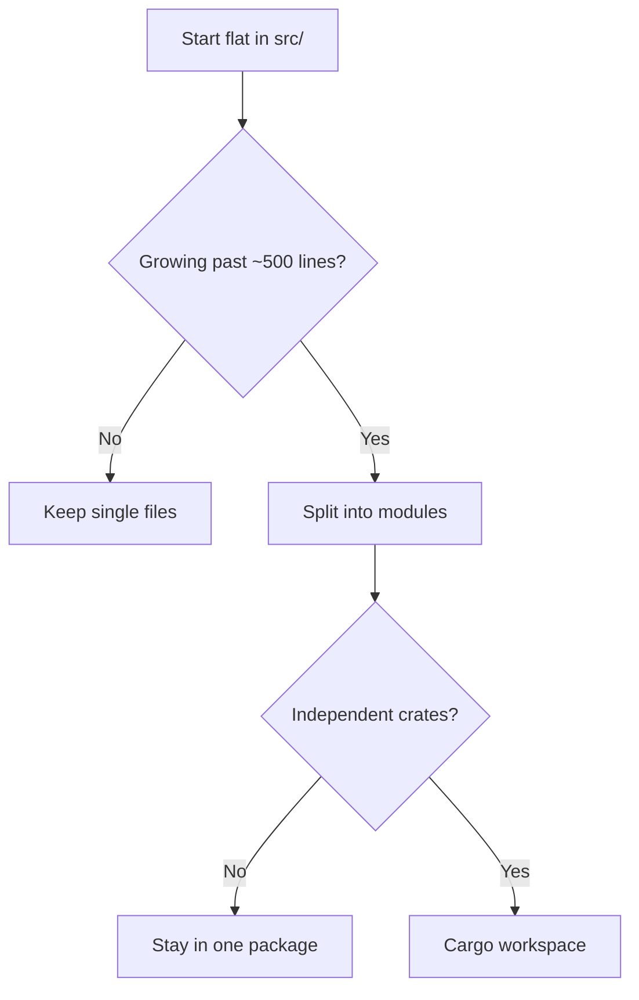

# Rust Project Organization

> **TL;DR** — Code lives directly in src/ (no src/crate_name/ nesting). Start flat, split into modules past ~500 lines, reach for workspaces only for truly independent crates.

## Key Principle

Unlike some other languages, Rust projects **do not** nest code under `src/crate_name/`. Code goes directly in `src/`, and the crate name is defined in `Cargo.toml`.



## Single Binary Project

The most common structure for applications:

```
my_project/
├── Cargo.toml
├── src/
│   ├── main.rs          # Entry point with fn main()
│   ├── lib.rs           # Optional: shared library code
│   ├── config.rs        # Single-file module
│   ├── utils.rs         # Single-file module
│   └── database/        # Multi-file module
│       ├── mod.rs       # Module root
│       ├── connection.rs
│       └── queries.rs
├── tests/               # Integration tests
│   └── integration_test.rs
└── examples/            # Example programs
    └── demo.rs
```

**Usage:**
```bash
cargo run                # Runs src/main.rs
cargo test              # Runs all tests
cargo run --example demo # Runs examples/demo.rs
```

## Single Library Project

For reusable libraries:

```
my_lib/
├── Cargo.toml
├── src/
│   ├── lib.rs           # Library entry point
│   ├── parser.rs        # Module file
│   ├── ast/             # Submodule directory
│   │   ├── mod.rs
│   │   ├── expr.rs
│   │   └── stmt.rs
│   └── error.rs
├── tests/               # Integration tests
│   └── parsing_tests.rs
├── benches/             # Benchmarks
│   └── parser_bench.rs
└── examples/
    └── basic_usage.rs
```

**Usage:**
```bash
cargo build             # Builds the library
cargo test              # Runs all tests
cargo doc --open        # Generate and open docs
```

## Binary + Library (Hybrid)

When you want both a library and a binary that uses it:

```
my_project/
├── Cargo.toml
├── src/
│   ├── main.rs          # Binary entry point
│   ├── lib.rs           # Library entry point
│   ├── core/
│   │   ├── mod.rs
│   │   └── engine.rs
│   └── cli/
│       ├── mod.rs
│       └── commands.rs
└── tests/
    └── integration.rs
```

In `main.rs`:
```rust
use my_project::core;  // Use the library code

fn main() {
    // CLI implementation
}
```

## Module Organization Patterns

<details>
<summary>Flat structure (small projects)</summary>

```
src/
├── main.rs
├── config.rs
├── database.rs
├── api.rs
└── utils.rs
```

</details>

<details>
<summary>Hierarchical structure (medium projects)</summary>

```
src/
├── main.rs
├── lib.rs
├── models/
│   ├── mod.rs
│   ├── user.rs
│   └── post.rs
├── services/
│   ├── mod.rs
│   ├── auth.rs
│   └── storage.rs
└── utils/
    ├── mod.rs
    └── helpers.rs
```

</details>

<details>
<summary>Feature-based structure (large projects)</summary>

```
src/
├── main.rs
├── lib.rs
├── auth/
│   ├── mod.rs
│   ├── login.rs
│   ├── signup.rs
│   └── session.rs
├── posts/
│   ├── mod.rs
│   ├── create.rs
│   ├── edit.rs
│   └── delete.rs
└── common/
    ├── mod.rs
    ├── error.rs
    └── types.rs
```

</details>

## Workspace (Multiple Crates)

For large projects with multiple related packages: share dependencies, build everything with one command, and keep internal crates in sync.

<details>
<summary>Workspace layout and manifest</summary>

```
my_workspace/
├── Cargo.toml           # Workspace manifest
├── crates/
│   ├── core/
│   │   ├── Cargo.toml
│   │   └── src/
│   │       └── lib.rs
│   ├── cli/
│   │   ├── Cargo.toml
│   │   └── src/
│   │       └── main.rs
│   └── web/
│       ├── Cargo.toml
│       └── src/
│           └── main.rs
└── README.md
```

**Workspace Cargo.toml:**
```toml
[workspace]
members = [
    "crates/core",
    "crates/cli",
    "crates/web",
]
resolver = "2"
```

</details>

## Module Declaration

<details>
<summary>Single-file and multi-file modules</summary>

### Single-file module

`src/config.rs`:
```rust
pub struct Config {
    pub port: u16,
}
```

`src/main.rs` or `src/lib.rs`:
```rust
mod config;  // Looks for src/config.rs

use config::Config;
```

### Multi-file module (directory)

`src/database/mod.rs`:
```rust
mod connection;  // Looks for connection.rs in same dir
mod queries;

pub use connection::Connection;
pub use queries::Query;
```

`src/main.rs`:
```rust
mod database;

use database::Connection;
```

### Modern alternative (Rust 2018+)

Instead of `mod.rs`, you can use a file with the directory name:

```
src/
├── main.rs
├── database.rs         # Module root (instead of database/mod.rs)
└── database/
    ├── connection.rs
    └── queries.rs
```

`src/database.rs`:
```rust
mod connection;
mod queries;

pub use connection::Connection;
```

</details>

<details>
<summary>Common project files and special directories</summary>

```
my_project/
├── Cargo.toml          # Package manifest
├── Cargo.lock          # Dependency lock file (commit for binaries)
├── .gitignore          # Git ignore (includes /target)
├── README.md           # Project documentation
├── LICENSE             # License file
├── src/                # Source code
├── tests/              # Integration tests
├── examples/           # Example programs
├── benches/            # Benchmarks
├── target/             # Build artifacts (gitignored)
└── .git/               # Git repository
```

- **`src/`** - Source code, required
- **`tests/`** - Integration tests (each file is a separate test binary)
- **`benches/`** - Benchmark tests (requires `cargo bench`)
- **`examples/`** - Example programs (run with `cargo run --example name`)
- **`target/`** - Build output (automatically created, should be gitignored)
- **`bin/`** - Additional binary targets (alternative to single `main.rs`)

</details>

<details>
<summary>Multiple binaries under <code>src/bin/</code></summary>

```
src/
├── lib.rs              # Shared library code
└── bin/
    ├── server.rs       # Binary 1
    ├── client.rs       # Binary 2
    └── admin.rs        # Binary 3
```

```bash
cargo run --bin server
cargo run --bin client
cargo run --bin admin
```

</details>

<details>
<summary>Unit vs integration test layout</summary>

### Unit tests

In the same file as the code:

```rust
// src/calculator.rs
pub fn add(a: i32, b: i32) -> i32 {
    a + b
}

#[cfg(test)]
mod tests {
    use super::*;

    #[test]
    fn test_add() {
        assert_eq!(add(2, 2), 4);
    }
}
```

### Integration tests

Separate files in `tests/`:

```
tests/
├── common/
│   └── mod.rs          # Shared test utilities
├── api_tests.rs
└── database_tests.rs
```

</details>

## Real-World Examples

- **ripgrep** - Binary with library: `src/lib.rs` + `src/main.rs`
- **tokio** - Workspace with multiple crates
- **serde** - Library with derive macro in separate crate
- **cargo** - Large workspace with feature-based organization

## Key takeaways

1. Start simple - flat structure with a few files
2. Create modules when files get too large (>500 lines)
3. Use `lib.rs` for reusable code, `main.rs` for CLI/app logic
4. Group related functionality into modules
5. Use workspaces for truly independent components
6. Keep module trees shallow (2-3 levels deep)
7. Use `pub use` to re-export important types at module root

## Next

- [The target/ Folder](./target-folder.md) — where the builds of this layout actually land on disk.
