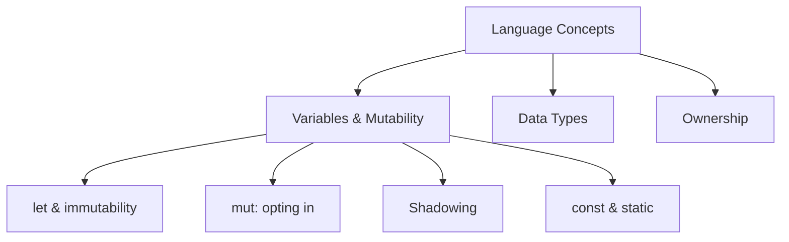

# Variables & Mutability

> **TL;DR** — Rust variables are **immutable by default**; you opt into mutation with `mut`. `let` binds a name to a value, and rebinding the same name (shadowing) creates a brand-new variable — it's not mutation. `const` is a compile-time constant; `static` is a global that lives for the whole program. Type inference does the heavy lifting, so you only annotate when the compiler can't tell.

This is part of the [Language Concepts](./language-concepts.md) series. It pairs with [Data Types](./data-types.md) (what values look like) and [Ownership](./rust-ownership.md) (what moving them around means).

## Where This Page Fits



## `let`: binding a name

`let` creates a **binding** — it gives a name to a value. Unlike Python, a Rust name is fixed to a *specific type* and a *specific lifetime*; you can't just reassign it to a different-shaped value (unless you shadow — see below).

```rust
let x = 5;          // bind 5 to the name x
let name = "Ada";   // &str
let count: u32 = 42; // you can annotate the type explicitly
```

```python
x = 5
name = "Ada"
count = 42
```

So far it looks the same. The difference shows up the moment you try to change a value.

## Immutable by default

Rust variables are **immutable** unless you say otherwise. This is the single biggest mental-model shift from Python:

```rust
let x = 5;
x = 6;   // ERROR: cannot assign twice to immutable variable `x`
```

```python
x = 5
x = 6   # fine — Python lets you mutate/reassign freely
```

### Why immutable by default?

Immutable bindings are the foundation of Rust's safety:

- **No accidental mutation.** A function you pass a value to *cannot* silently change it. You can read a value and trust it stayed the same.
- **Concurrency-friendly.** Immutable data can be shared across threads with no lock. `Send`/`Sync` (see [Concurrency without a GIL](./concurrency-gil.md)) rely on knowing whether a value can change.
- **Compiler optimization.** Knowing a value never changes lets the optimizer and the borrow checker reason more freely.

Python gives you mutable-by-default and relies on discipline. Rust gives you immutable-by-default and makes you *choose* mutation — which is precisely the discipline, enforced.

## `mut`: opt in to mutation

When you genuinely need to change a value, add `mut`:

```rust
let mut x = 5;
x = 6;             // now fine — `mut` grants the permission
println!("{x}");   // 6

let mut s = String::from("hello");
s.push_str(", world!");   // bound method takes &mut self
println!("{s}");
```

```python
x = 5
x = 6
s = "hello"
s += ", world!"
```

**Rule of thumb:** start without `mut`. If the compiler complains "cannot assign twice," ask whether you actually need to mutate — often a fresh `let` or an owned value is the better answer. Adding `mut` is a deliberate, visible choice.

| | Python | Rust |
|---|--------|------|
| Default | Mutable | **Immutable** |
| To mutate | Just assign | Add `mut` |
| Why | Convenience | Safety — no surprise side effects |

## Type inference

Rust infers types from usage, so you rarely write them. `5` is `i32`; `2.0` is `f64`; `"hi"` is `&str`. You only annotate when:

- The compiler has no hint (e.g., a variable with no initializer, or a `None`).
- You want to force a specific type for clarity or API compatibility (e.g., `u64` for a timestamp).

```rust
let n = 42;            // inferred i32
let big: u64 = 1_000;  // explicit — you WANT u64
let mut v: Vec<f64> = Vec::new();  // Vec::new() needs a type hint
```

```python
n = 42        # Python infers too, but the type is dynamic
```

## Shadowing

`let` on an *existing* name creates a **new variable** that *hides* the old one. The old binding is not mutated — it's simply no longer visible under that name. Because it's a fresh variable, the **type can change**:

```rust
let input = "42";                              // &str
let input = input.parse::<i32>().unwrap();     // new `input`: i32
let input = input * 2;                         // new `input`: i32, value 84
```

```python
input = "42"
input = int(input)   # Python mutates the same name, but the type changes too
```

The difference: in Python the *same* variable name now points at a different object. In Rust, each `let input` is a **separate binding** — the old `&str` is still there, just hidden.

**Shadowing vs `mut`:**

| | `mut` | Shadowing |
|---|-------|-----------|
| What happens | Mutates the existing value in place | Creates a new binding, hides the old |
| Type can change? | **No** — same type | **Yes** — a fresh variable can be any type |
| When to use | You need to update a value over time | You're transforming a value into a new shape |

> [!NOTE]
> Depending on where the name binds, shadowing often has a different *lifetime* too — each `let` is a distinct variable that goes out of scope in reverse order.

Shadowing is also discussed in [Ownership](./rust-ownership.md#shadowing) in the context of `parse` and moved values.

## `const`: compile-time constants

`const` defines a value that must be known **at compile time** and is **inlined** wherever it's used. It's not a variable — it's a named constant.

```rust
const MAX_POINTS: u32 = 100_000;

fn main() {
    println!("{MAX_POINTS}");
    let n = MAX_POINTS * 2;
}
```

**Rules:**
- The name is **`SCREAMING_SNAKE_CASE`** by convention.
- The **type must be annotated** (`const MAX_POINTS: u32 = ...`).
- The value must be a **constant expression** — no `String::new()`, no function calls, no heap allocation. (There's `const fn` for compile-time functions, but that's advanced.)
- There's **no `mut const`** — constants are permanent.

```python
MAX_POINTS = 100_000   # Python: just a variable you promise not to change
```

**When to use `const`:** any magic number, threshold, or configuration value that's fixed at compile time — array sizes, rates, limits, enum-like sentinels.

## `static`: global variables

`static` declares a value with a **`'static` lifetime** — it lives for the entire program, in the binary's storage. Unlike `const`, it has an *address in memory* you can take.

```rust
static GREETING: &str = "Hello, world!";   // immutable static

static mut COUNTER: u32 = 0;               // mutable static — RARE, & unsafe to touch
```

```python
GREETING = "Hello, world!"   # a module-level constant-ish variable
```

**Rules:**
- **`static mut` is discouraged.** Reading/writing mutable statics is `unsafe` because you can't guarantee a single thread is accessing it. Prefer `Mutex`/`AtomicU*` (e.g. `AtomicU32`) for real shared mutable state — see [Concurrency without a GIL](./concurrency-gil.md).
- Use **immutable `static`** when you need a global value you can take a reference to (e.g., a shared read-only config, a bit-flag table).
- `static` with a `'static` lifetime is a *value that never drops*.

**`const` vs `static` — pick based on need:**

| | `const` | `static` |
|---|---------|----------|
| Lifetime | Compile-time; inlined | Whole program; has an address |
| Take a reference? | Not directly | Yes (`&STATIC`) |
| Mutable | No | Possible but `unsafe` |
| Use for | Fixed compile-time values | Globals you need an address / shared read-only data |

## All binding forms at a glance

| Keyword | Mutable? | Scope | Use |
|---------|----------|-------|-----|
| `let` | No (default) | Block | Normal local variable |
| `let mut` | Yes | Block | Local you update over time |
| `const` | No | Entire program (inlined) | Named compile-time constant |
| `static` | No (usually) | Entire program (has address) | Global value, shared read-only data |
| `static mut` | Yes (`unsafe`) | Entire program | Rare — prefer `Mutex`/atomics |

## Key Takeaways

1. Rust variables are **immutable by default** — opt in with `mut`. This is the safety foundation: no surprise mutation, easy sharing across threads.
2. **Shadowing** (`let` again on the same name) is *not* mutation — it's a fresh binding that can even change type.
3. **`const`** is a compile-time constant, inlined; **`static`** is a program-lifetime global with an address. Use them for constants and shared globals, not everyday mutation.
4. Let type inference work for you; annotate only when the compiler needs a hint or you want a specific width (`u64`, `f32`).

## Next

- [Data Types](./data-types.md) — what the values bound to those names look like.
- [Ownership](./rust-ownership.md) — what happens to a value when you move or borrow it.
- [Concurrency without a GIL](./concurrency-gil.md) — why immutability and `Send`/`Sync` matter for threads.
